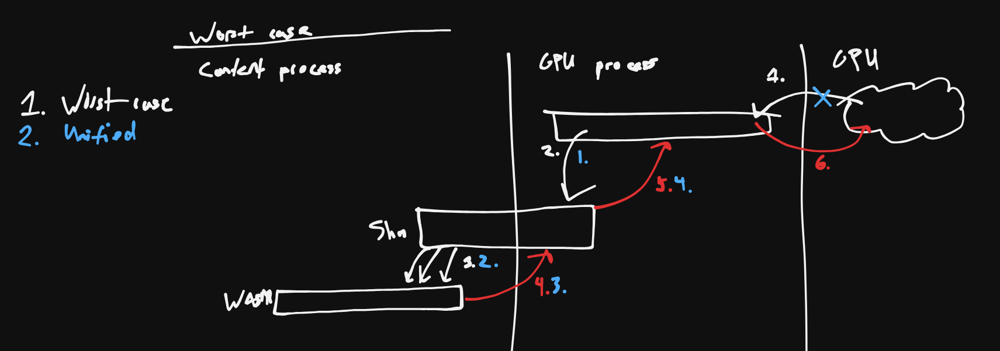
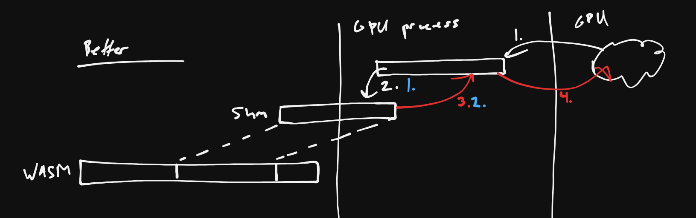

# BYOB (and friends) for WebAssembly.Memory

_(A sub-proposal of the [WebAssembly memory control proposal](Overview.md).)_

The most common way of reducing copies in Web APIs is through typed arrays, streams, and BYOB. For example, Response, Blob, and OPFS support BYOB through [ReadableStream](https://developer.mozilla.org/en-US/docs/Web/API/ReadableStreamBYOBReader), allowing you to stream data directly into an ArrayBuffer you control.

Unfortunately, WebAssembly memory [cannot today be used with BYOB](https://github.com/rustwasm/wasm-bindgen/discussions/3579#discussioncomment-6852579). This is very unfortunate, but the spec could possibly be extended to allow [shared](https://github.com/WebAssembly/threads) WebAssembly memories to work with BYOB.

## Details

The buffer-detaching behavior of BYOB is presumably to prevent intermediate results to be observed by JS, even in the case where the stream task is occurring on a background thread. However, `shared` WebAssembly memory (and `SharedArrayBuffer` by extension) should be able to treat this situation as a data race, with no need to detach the buffer. See some [past discussion](https://github.com/whatwg/streams/issues/757) of this issue.

Semantically, this is a fairly small change, and would address a wide variety of use cases.

### Why shared memory?

There are multiple reasons why `shared` memory is a sensible requirement for BYOB:

- Intermediate results may be visible to JavaScript or WebAssembly code while the BYOB write is in progress. The semantics of [`SharedArrayBuffer`](https://developer.mozilla.org/en-US/docs/Web/JavaScript/Reference/Global_Objects/SharedArrayBuffer) in JavaScript and `shared` memory in WebAssembly can handle this gracefully by categorizing this behavior as a mere data race.

- The same restrictions imposed on `shared` memories are necessary for BYOB as well. For example, `shared` WebAssembly memories must have a `max` to ensure that the memory never needs to be relocated on grow—behavior which would be problematic for both web workers and BYOB.

## WebGPU

WebGPU does not use streams. Instead, the primary way of getting GPU data into the CPU is with [`GPUBuffer.mapAsync`](https://developer.mozilla.org/en-US/docs/Web/API/GPUBuffer/mapAsync), which returns a new `ArrayBuffer` containing the GPU data. To use this data in WebAssembly, the data must be copied yet again into the WebAssembly memory, and if the buffer is `GPUMapMode.WRITE`, then it must be copied back to the source `ArrayBuffer` before `GPUBuffer.unmap()`.

Here is a high-quality diagram of how things work today. The number of copies performed throughout the process varies depending on whether the system has a discrete GPU (white) or unified graphics memory (blue).

This could possibly be solved with a new `GPUBuffer.mapAsyncInto(mem)` API. This would be a BYOB-style API that writes GPU data directly into a WebAssembly memory, skipping the intermediate `ArrayBuffer`. The precise semantics would be:

- On `mapAsyncInto`, WebGPU writes the contents of the GPU data directly into WebAssembly memory. This could be implemented without copies by allocating a file object (in memory) for the GPU data, and mapping that file into a portion of WebAssembly memory.

- On `unmap`, WebGPU zeroes all mapped regions of WebAssembly memory, copying the data out first if mapped in `GPUMapMode.WRITE`. This could be implemented by simply replacing the formerly-mapped pages with fresh physical pages (analogous to a [`memory.discard`](discard.md)).

Overall, `GPUBuffer.mapAsyncInto` would replace the cost of a copy with the cost of some virtual memory calls—possibly a win.

Here is a similarly intricate diagram of the copies incurred by `mapAsyncInto`:

(TODO: I sincerely apologize for the above diagrams, and plan to replace them eventually.)

## Previous discussions

https://github.com/WebAssembly/design/issues/1162